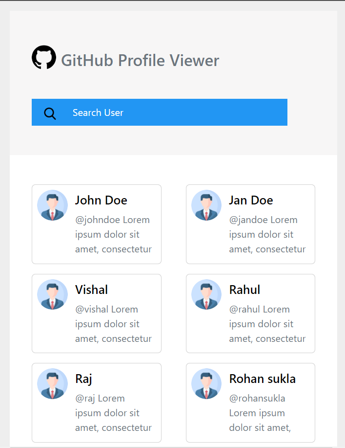
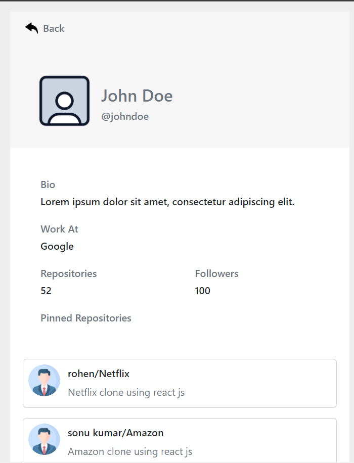
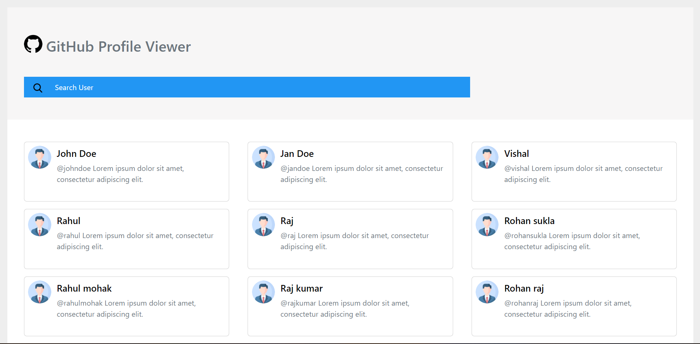
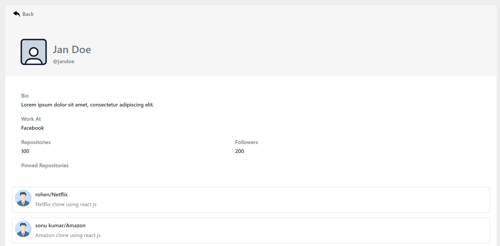

# GitHub Profile Viewer

## Hosted Link -- https://github-profile-viewer-f8ca6.web.app/

#

### Description

`GitHub profile viewer is a two screen web application, where application user can search for a profile and view user details on a separate screen.`

## Folder Structure

```
github-profile-viewer
├─ .gitignore
├─ package-lock.json
├─ package.json
├─ public
│  ├─ favicon.ico
│  ├─ index.html
│  ├─ logo192.png
│  ├─ logo512.png
│  ├─ manifest.json
│  └─ robots.txt
├─ README.md
└─ src
   ├─ App.js
   ├─ component
   │  ├─ HeadingCard.js
   │  ├─ ProfileCard.js
   │  ├─ RepoCard.js
   │  ├─ Search.js
   │  ├─ UserProfileData.js
   │  └─ UserProfileHeading.js
   ├─ css
   │  └─ search.css
   ├─ helper
   │  ├─ profile.js
   │  └─ repositories.js
   ├─ index.css
   ├─ index.js
   └─ page
      ├─ Home.js
      └─ Profile.js

```

## Some ScreenShots of Project

### Mobile View




### Laptop View



